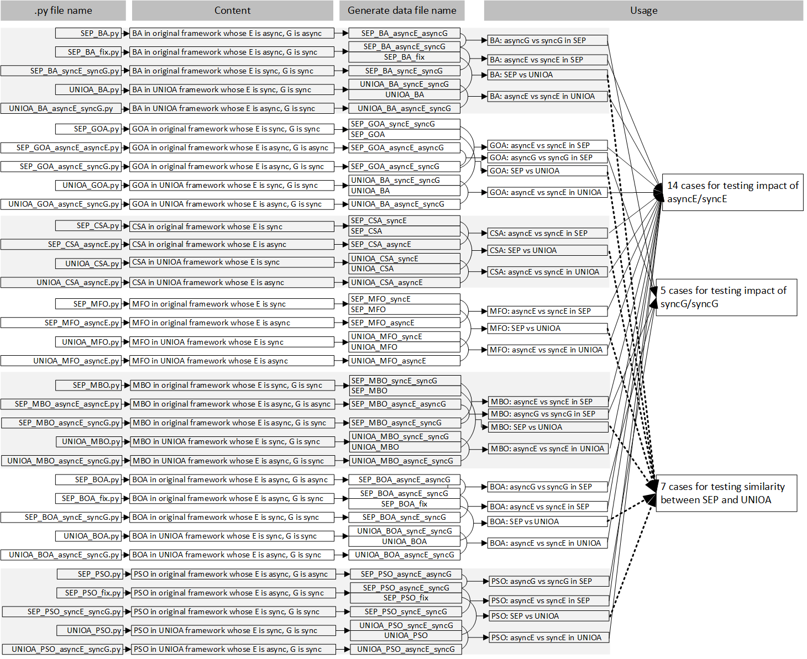

# Thesis Project
- [ Overview. ](#ov)
- [ Experiment details. ](#ep)
  - [ Experiment 1 ](#ep1)
- [ Environment. ](#env)
- [ Example. ](#exm)
  - [ customized optimizer. ](#exm1)
  - [ benchmark and comparison. ](#exm2)
  - [ results of example experiment. ](#exm3)
- [ Coding errors. ](#cod)

<a name="ov"></a>
## Overview
1. motivation of this project:
   1. recently proposed nature-inspired algorithms are not such novel and not such mysterious.
   2. because they are repeating same concepts/ideas of some old typical algorithms.
   3. this problem will mislead the research community(e.g. Algorithm design is no longer concerned with whether it really proposes an effect algorithm, but only with whether there is a new name algorithm)
2. solution to the problem:
    1. the novelty/special parts of algorithms will be easier to be found, if these algorithms could be discussed in only one environment.
    2. this only one environment is such a place in which algorithms use same terminologies, 

3. experiments to prove the solution is correct:

4. conclusion:

5. shortcomings:
   
6. comparison with other relative papers:

6. future imagination:

<a name="ep"></a>
## Experiments 
As shown in the picture, we did 47 There are four experiments.

<a name="ep1"></a>
### experiment 1: 
| file name | usage |
| --------- | ----- |
| SEP


Click [here](https://surfdrive.surf.nl/files/index.php/s/sffBTtaFT5Yynrx) to access all data and referenced papers used in this thesis project.

# Data Science Lab
1. mithril.liacs.nl
2. octiron.liacs.nl
3. duranium.liacs.nl

# File Structure

# Usage
```
usage: run.py [-h] -n  [-p] [-d] [-i] [-r]

Execute Experiments on IOHanalyzer.

optional arguments:
  -h, --help          show this help message and exit
  -n , --name         Optimizer will be executed.
  -p , --problems     Problems used to optimize (default: from Problem-1 to Problem-24).
  -d , --dimensions   Dimensions used to experiments (default: Dimension-5 and Dimension-20).
  -i , --instances    Number of instances used to experiments (default: 5 instances).
  -r , --runs         Number of experiments executed per problem per instance per dimension (default: 5 runs).

```
# Needed
```
Python 3.7.7
Numpy 1.18.2
IOHexperimenter
```
<a name="cod"></a>
## Coding errors
1. avoid side effects of ``=``, must use ``copy.copy()`` somewhere. For example, when you need to create a new variable that is equal to the old variable, but not throw away the old one. Specifically, if you will use the right-variable in the following steps, please use copy.copy(single_number)/[list/array].copy()