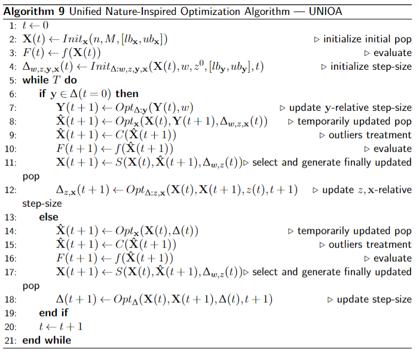
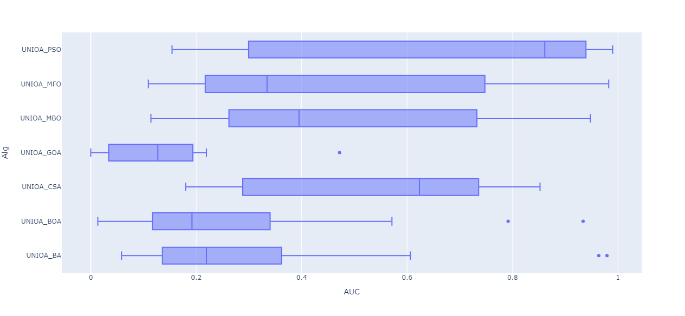

# Standardizing Nature-inspired Algorithms: a unified framework UNIOA for seven swarm-based algorithms
- [ Main Work ](#ov)
- [ Experiments ](#ep)
  - [ Group 1 ](#ep1)
  - [ Group 2 ](#ep2)
  - [ Group 3 ](#ep3)
- [ Benchmark Environment ](#env)
- [ Pseudo-code of algorithms in UNIOA ](#pse)
- [ Notes ](#note)

<a name="ov"></a>
## Main work
For solving the problem that most of the modern swarm-based optimization algorithms are frequently repeating similar core ideas, we proposed a unified framework UNIOA in which seven different swarm-based optimization algorithms can be represented in same terminologies with same tuples. Meanwhile, the positions of these tuples are also same when building up these seven algorithms.


```math
UNIOA = (f, Init_x, Opt_x, C, T, S, Init_delta, Opt_delta)
```


<a name="ep"></a>
## Experiments 
We did three groups of experiments. Check [here](https://surfdrive.surf.nl/files/index.php/s/sffBTtaFT5Yynrx) for all experimental data used in this thesis project.

<a name="ep1"></a>
### Group 1 
Group 1 is for avoiding side effects. In our many experiments, we found the way of evaluating the fitness and the way of calculating the global best individual might impact the performance of algorithms. The experimental results show that the way of evaluating the fitness will not impact the performance of algorithm, but the way of calculating the global best individual will.

Therefore, when we reproduced the original implementation, we kept the way of evaluating fitness as its original way, but modified the way of calculating the global best individual as the way in our unified framework.

<a name="ep2"></a>
### Group 2 
Group 2 is for verifying whether our unified framework can work correctly as their original framework. The experimental results show that the performance of algorithms in our unified framework is same as the performance of algorithms in their original framework.

Therefore, we conclude that our unified framework can safely replace the original framework of algorithms. 

<a name="ep3"></a>
### Group3 
Group 3 is for observing the performance of these seven selected algorithms in our unified framework. 





<a name="pse"></a>
## Benchmark Environment
Our experiments are built up in the <a href="https://iohprofiler.github.io/">IOHprofiler</a> for implementing algorithms in <a href="https://iohprofiler.github.io/IOHexp/">IOHexperimenter</a> and analysing their performances in <a href="https://iohanalyzer.liacs.nl/">IOHanalyzer</a>.


<a name="env"></a>
## Pseudo-code of algorithms in UNIOA
> see ./pseudo_code_in_UNIOA


<a name="package"></a>
## UNIOA library
> The general application of our unified framework is to design an auto-designer for swarm-based algorithms. A demo of such an application is <a href="https://github.com/Huilin-Li/UNIOA">UNIOA</a>.


<a name="note"></a>
## Notes
1. avoid side effects of ``=``, must use ``copy.copy()`` somewhere. For example, when you need to create a new variable that is equal to the old variable, but not throw away the old one. Specifically, if you will use the right-variable in the following steps, please use ```copy.copy(single_number)/[list/array].copy()```. Moreover, ``def`` cannot avoid this kind of errors, and must use copy
2. mithril.liacs.nl
3. octiron.liacs.nl
4. duranium.liacs.nl